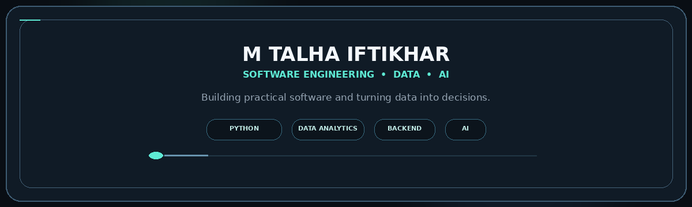
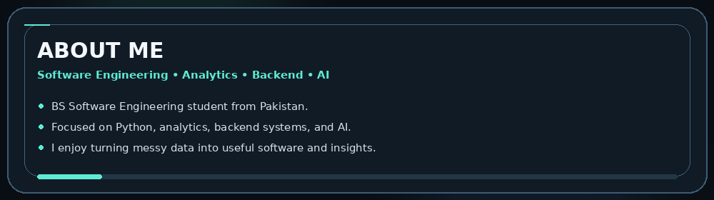
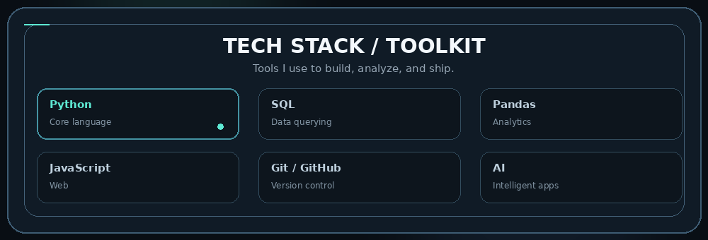
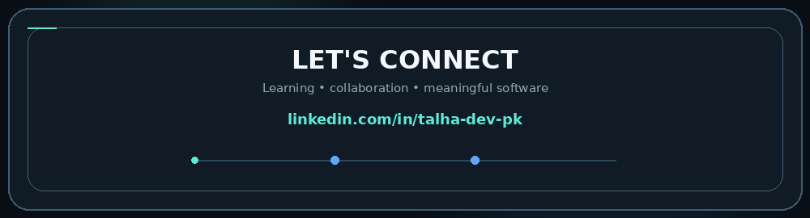

# 👋 Hi, Myself

### Software Engineering Student • Python • Data Analytics • AI

I build practical, data-driven software and explore how AI can make real analytical workflows faster, clearer, and more useful.

## 🧭 About Me

I'm a **BS Software Engineering student from Pakistan** focused on building practical applications across **Python, Data Analytics, Backend Development, and AI**.

I enjoy turning raw data into meaningful insights, building useful software around those insights, and learning the engineering required to move from an idea to a working product.

## 🛠️ Tech Stack

### Languages & Querying

### Data & Analytics

### Web, Backend & Tools

## 📊 Data Analysis Skills

- Data profiling and quality assessment
- Exploratory Data Analysis (EDA)
- Missing-value and duplicate detection
- Data validation and consistency checks
- Aggregation, filtering, ranking, and segmentation
- Trend and time-series analysis
- Outlier detection using IQR-based methods
- Correlation analysis
- Visualization and dashboard-oriented reporting
- Turning analytical results into clear business insights
- AI-assisted analytics workflows

## 🌐 Let's Connect

I'd be glad to connect for **learning opportunities, collaboration, interesting projects, software engineering, and data analytics**.

### 🔗 [Connect with me on LinkedIn](https://www.linkedin.com/in/talha-dev-pk)

### Thanks for visiting 👋

*Built with curiosity, code, data, and a lot of debugging.*

